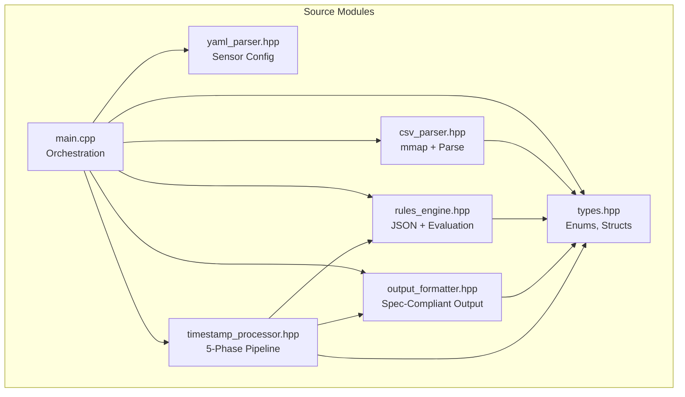
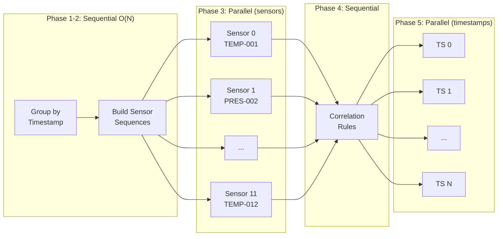

# AstraLog-HPC — Rewrite Walkthrough

## Summary

Complete rewrite of the AstraLog-HPC processing engine from a monolithic 2-file structure to a modular 7-file architecture, fixing all identified correctness and design issues.

---

## Issues Fixed

| # | Issue | Fix |
|---|---|---|
| 3 | `valid_data.csv` wrote per-sensor lines instead of per-timestamp aggregated | Per-timestamp grouping with `TIMESTAMP; NOMINAL; S1:V1\|S2:V2\|...` format |
| 4 | `evaluate_step_diff()` used `std::abs()` on delta | Removed `abs()` — signed delta compared directly per spec |
| 5 | `alarms.log` missing spaces after semicolons | All separators now use `"; "` (semicolon-space) |
| 6 | No per-timestamp grouping logic | Full pipeline: group → evaluate → correlate → decide NOMINAL/ANOMALOUS per timestamp |
| 7/8 | Parallelization too shallow | 3 parallel phases: CSV parse, per-sensor evaluation, output formatting |
| 9 | No priority-based rule ordering | Rules sorted HIGH→MEDIUM→LOW within each type before evaluation |
| 13 | Monolithic code (2 files) | Split into 7 focused modules |

**Also fixed:**
- Singularity.def: removed stale Python/ZeroMQ dependencies
- Priority field: now optional (defaults to LOW per spec)
- Output stats: reports timestamps/nominal/anomalous counts

---

## New Architecture



---

## File-by-File Summary

### [types.hpp](file:///c:/Users/anton/Desktop/AgostaAmodeoAnzalone/src/types.hpp) — `NEW`
Core types shared across all modules:
- `Priority`, `RuleType`, `CompOp` enums with string conversions
- `RuleDefinition` — in-memory rule from JSON
- `SensorState` — cache-aligned (64B) per-sensor state for step_diff/stateful
- `ParsedRecord` — validated CSV row
- `TimestampGroup` — all sensor readings at one timestamp
- `RuleViolation` — detected anomaly (supports both single and correlation)

---

### [csv_parser.hpp](file:///c:/Users/anton/Desktop/AgostaAmodeoAnzalone/src/csv_parser.hpp) — `NEW`
Memory-mapped CSV parsing:
- `MappedFile` — RAII mmap wrapper with `MADV_SEQUENTIAL`
- `build_line_offsets()` — sequential pre-scan for O(1) line access
- `tokenize_csv_line()` — zero-copy 4-field tokenization
- `validate_schema()` — ESA-compliant validation (empty, ERR, CORRUPT)
- `parse_csv_parallel()` — OpenMP parallel-for with static scheduling, preserving CSV order

---

### [yaml_parser.hpp](file:///c:/Users/anton/Desktop/AgostaAmodeoAnzalone/src/yaml_parser.hpp) — `NEW`
- `load_sensors_from_yaml()` — extracts sensor IDs from `sensors.yaml`

---

### [rules_engine.hpp](file:///c:/Users/anton/Desktop/AgostaAmodeoAnzalone/src/rules_engine.hpp) — `REWRITTEN`
Rule loading and evaluation:
- `MiniJsonParser` — dependency-free JSON parser (unchanged)
- `load_rules()` — deserializes JSON, priority now optional (defaults LOW)
- `sort_by_priority()` — sorts rule pointers HIGH→MEDIUM→LOW
- `evaluate_threshold()` — simple absolute check
- `evaluate_step_diff()` — **FIXED: signed delta, no abs()**
- `evaluate_stateful()` — consecutive violation counter

> [!IMPORTANT]
> **Key fix in `evaluate_step_diff()`**: The old code used `std::abs(value - previous)` which broke rules like `operator: "<", value: -2.0`. A drop from 103→100 gives delta = -3.0. With `abs()`, that becomes 3.0 and `3.0 < -2.0` is false (missed alarm). Without `abs()`, `-3.0 < -2.0` is true (correct alarm).

---

### [output_formatter.hpp](file:///c:/Users/anton/Desktop/AgostaAmodeoAnzalone/src/output_formatter.hpp) — `NEW`
Spec-compliant output formatting:
- `format_value()` — strips trailing zeros (e.g. `25.5`, `36.0`)
- `format_nominal_line()` — `TIMESTAMP; NOMINAL; S1:V1|S2:V2|...`
- `format_alarm_lines()` — `TIMESTAMP; RULE_ID; PRIORITY; SENSOR(S); VALUE(S)`

> [!NOTE]
> All separators use `"; "` (semicolon-space). Correlation violations use `", "` (comma-space) between sensors/values.

---

### [timestamp_processor.hpp](file:///c:/Users/anton/Desktop/AgostaAmodeoAnzalone/src/timestamp_processor.hpp) — `NEW`
The core processing pipeline with 5 phases:

| Phase | Parallelism | Description |
|---|---|---|
| 1 | Sequential | Group records by timestamp → `TimestampGroup` |
| 2 | Sequential | Build per-sensor reading sequences |
| 3 | **Parallel (sensors)** | OpenMP `parallel for` across sensors — each sensor's timeline evaluated independently |
| 4 | Sequential | Correlation rule evaluation (AND/OR of sub-rules) |
| 5 | **Parallel (timestamps)** | OpenMP `parallel for` for output string formatting |

---

### [main.cpp](file:///c:/Users/anton/Desktop/AgostaAmodeoAnzalone/src/main.cpp) — `REWRITTEN`
Thin orchestrator (~230 lines vs old 824 lines):
1. Parse CLI args
2. Load sensors YAML + rules JSON
3. Memory-map CSV + build line index
4. Parallel CSV parse
5. Call `process_pipeline()` — returns formatted output strings
6. Sequential write to `valid_data.csv` + `alarms.log`
7. Print execution statistics

---

## Parallelization Strategy (3-Person Group Requirement)



**Three parallel phases:**

1. **Parallel CSV Parse** (Phase 0 in main.cpp): `#pragma omp parallel for schedule(static)` across CSV lines. Scales with file size (500K+ lines).

2. **Parallel Per-Sensor Evaluation** (Phase 3): `#pragma omp parallel for schedule(dynamic)` across sensors. Each sensor is processed by exactly one thread, which evaluates its full timeline sequentially (required for step_diff/stateful correctness). Different sensors are fully independent → no synchronization needed. Thread-local violation maps avoid contention.

3. **Parallel Output Formatting** (Phase 5): `#pragma omp parallel for schedule(static)` across timestamps. Each timestamp's output string is formatted independently.

**Why this design:**
- Step_diff and stateful rules have **per-sensor data dependencies** (previous value, consecutive count). Processing one sensor's readings sequentially is mandatory for correctness.
- Different sensors have **no cross-dependencies** (except correlation, which is a separate phase), making sensor-level parallelism safe.
- Per-thread violation maps avoid all locking on the critical path.

---

## Output Format Compliance

### valid_data.csv (NOMINAL timestamps)
```
2025-11-15T12:00:00Z; NOMINAL; TEMP-01:25.5|PRES-01:101.3|VOLT-MAIN:24.1
```
- Space after each `;`
- All sensors pipe-separated on one line per timestamp
- Only written when **zero** rules fire at that timestamp

### alarms.log (ANOMALOUS timestamps)
```
2025-11-15T12:00:05Z; R1; MEDIUM; TEMP-01; 51.2
2025-11-15T12:00:05Z; R4; HIGH; TEMP-01, PRES-01; 51.2, 98.0
```
- Space after each `;`
- Correlation rules list all sub-rule sensors/values with `, ` separator
- One line per violated rule

---

## Files Not Modified

| File | Reason |
|---|---|
| `CMakeLists.txt` | Only compiles `src/main.cpp`; headers auto-included |
| `job.sh` | SLURM script unchanged — same executable interface |
| `build_and_run.sh` | Same build + run workflow |
| `input/*` | Data files unchanged |

## Files Updated

| File | Change |
|---|---|
| [Singularity.def](file:///c:/Users/anton/Desktop/AgostaAmodeoAnzalone/Singularity.def) | Removed Python/pip/ZeroMQ; kept only g++/cmake/OpenMP |
